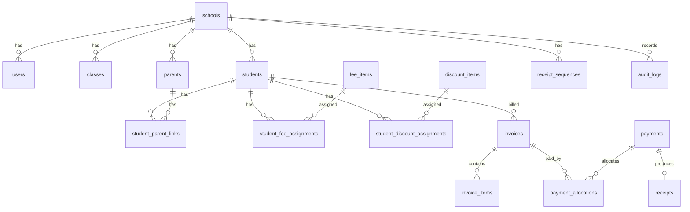

# Database Design Draft

Version: 0.1
Date: 2026-06-25
Database: MySQL

## 1. Design Principles

The database should support the MVP finance workflow first:

```text
Student -> Fee Assignment -> Monthly Invoice -> Payment -> Receipt -> Reports
```

Core principles:

- Every school-owned business record includes `school_id`.
- Current fee settings and historical invoice records are separate.
- Invoices store snapshots of fees and discounts at generation time.
- Receipt numbers are generated by backend transaction logic, not by users.
- Financial mistakes are voided or adjusted, not hard-deleted.
- Tables should support future multi-school and SaaS use without code redesign.

## 2. High-Level Entity Map



## 3. Table Groups

### 3.1 Foundation

- `schools`
- `users`
- `roles`
- `user_roles`
- `classes`
- `audit_logs`

### 3.2 Student and Parent Records

- `students`
- `parents`
- `student_parent_links`

### 3.3 Fee Setup

- `fee_items`
- `student_fee_assignments`
- `discount_items`
- `student_discount_assignments`

### 3.4 Billing

- `invoice_sequences`
- `invoices`
- `invoice_items`

### 3.5 Payments and Receipts

- `payments`
- `payment_allocations`
- `receipt_sequences`
- `receipts`

## 4. Foundation Tables

### 4.1 `schools`

Stores each school or education centre under the group.

| Column | Type | Notes |
| --- | --- | --- |
| id | bigint unsigned | Primary key |
| code | varchar(20) | Unique school code, e.g. `MIS` |
| name | varchar(255) | School name |
| receipt_prefix | varchar(20) | Usually same as code |
| invoice_prefix | varchar(20) | Optional, e.g. `MIS-INV` |
| email | varchar(255) | Nullable |
| phone | varchar(50) | Nullable |
| address | text | Nullable |
| status | enum | `active`, `inactive` |
| created_at | timestamp |  |
| updated_at | timestamp |  |

Constraints:

- Unique: `code`

### 4.2 `users`

Stores system users.

| Column | Type | Notes |
| --- | --- | --- |
| id | bigint unsigned | Primary key |
| school_id | bigint unsigned | Nullable for group-level users |
| name | varchar(255) |  |
| email | varchar(255) | Login email |
| password | varchar(255) | Hashed password |
| status | enum | `active`, `inactive` |
| last_login_at | timestamp | Nullable |
| created_at | timestamp |  |
| updated_at | timestamp |  |

Constraints:

- Unique: `email`
- Foreign key: `school_id -> schools.id`

### 4.3 `roles`

Stores role definitions.

| Column | Type | Notes |
| --- | --- | --- |
| id | bigint unsigned | Primary key |
| name | varchar(100) | `Super Admin`, `CEO`, `School Admin`, `Finance` |
| slug | varchar(100) | Unique machine name |
| created_at | timestamp |  |
| updated_at | timestamp |  |

Constraints:

- Unique: `slug`

### 4.4 `user_roles`

Allows users to hold one or more roles.

| Column | Type | Notes |
| --- | --- | --- |
| id | bigint unsigned | Primary key |
| user_id | bigint unsigned |  |
| role_id | bigint unsigned |  |
| created_at | timestamp |  |

Constraints:

- Unique: `(user_id, role_id)`

### 4.5 `classes`

Represents school classes or year groups.

| Column | Type | Notes |
| --- | --- | --- |
| id | bigint unsigned | Primary key |
| school_id | bigint unsigned |  |
| name | varchar(100) | e.g. `Year 1`, `Kindergarten 2` |
| status | enum | `active`, `inactive` |
| created_at | timestamp |  |
| updated_at | timestamp |  |

Constraints:

- Unique: `(school_id, name)`

## 5. Student and Parent Tables

### 5.1 `students`

| Column | Type | Notes |
| --- | --- | --- |
| id | bigint unsigned | Primary key |
| school_id | bigint unsigned |  |
| class_id | bigint unsigned | Nullable |
| student_no | varchar(50) | School-level student ID |
| full_name | varchar(255) |  |
| gender | enum | `male`, `female`, `other` |
| dob | date | Nullable |
| registration_date | date | Nullable |
| status | enum | `active`, `inactive`, `graduated`, `withdrawn` |
| notes | text | Nullable |
| created_at | timestamp |  |
| updated_at | timestamp |  |

Constraints:

- Unique: `(school_id, student_no)`
- Foreign keys: `school_id`, `class_id`

### 5.2 `parents`

| Column | Type | Notes |
| --- | --- | --- |
| id | bigint unsigned | Primary key |
| school_id | bigint unsigned |  |
| full_name | varchar(255) |  |
| phone | varchar(50) |  |
| email | varchar(255) | Nullable |
| address | text | Nullable |
| emergency_contact | varchar(50) | Nullable |
| notes | text | Nullable |
| created_at | timestamp |  |
| updated_at | timestamp |  |

Indexes:

- `(school_id, phone)`
- `(school_id, email)`

### 5.3 `student_parent_links`

Many-to-many relationship between students and parents.

| Column | Type | Notes |
| --- | --- | --- |
| id | bigint unsigned | Primary key |
| school_id | bigint unsigned |  |
| student_id | bigint unsigned |  |
| parent_id | bigint unsigned |  |
| relationship | enum | `father`, `mother`, `guardian`, `other` |
| is_primary_contact | boolean | Default false |
| created_at | timestamp |  |
| updated_at | timestamp |  |

Constraints:

- Unique: `(student_id, parent_id, relationship)`

## 6. Fee Setup Tables

### 6.1 `fee_items`

Defines reusable school-level fee items.

| Column | Type | Notes |
| --- | --- | --- |
| id | bigint unsigned | Primary key |
| school_id | bigint unsigned |  |
| name | varchar(255) | e.g. `Tuition Fee` |
| code | varchar(50) | Optional |
| fee_type | enum | `recurring`, `one_time` |
| default_amount | decimal(10,2) |  |
| status | enum | `active`, `inactive` |
| created_at | timestamp |  |
| updated_at | timestamp |  |

Constraints:

- Unique: `(school_id, name)`

### 6.2 `student_fee_assignments`

Stores fee items assigned to each student.

| Column | Type | Notes |
| --- | --- | --- |
| id | bigint unsigned | Primary key |
| school_id | bigint unsigned |  |
| student_id | bigint unsigned |  |
| fee_item_id | bigint unsigned |  |
| amount | decimal(10,2) | Student-specific amount |
| start_date | date | Nullable |
| end_date | date | Nullable |
| billing_month | varchar(7) | Nullable; for one-time fee target month, `YYYY-MM` |
| status | enum | `active`, `inactive` |
| notes | text | Nullable |
| created_at | timestamp |  |
| updated_at | timestamp |  |

Indexes:

- `(school_id, student_id, status)`
- `(school_id, fee_item_id)`

MVP interpretation:

- Recurring fees are included when active and within the effective date range.
- One-time fees are included once for the configured billing month or manually selected invoice run.

### 6.3 `discount_items`

Defines reusable school-level discounts.

| Column | Type | Notes |
| --- | --- | --- |
| id | bigint unsigned | Primary key |
| school_id | bigint unsigned |  |
| name | varchar(255) | e.g. `Sibling Discount` |
| discount_type | enum | `fixed`, `percentage` |
| default_value | decimal(10,2) | Amount or percentage |
| status | enum | `active`, `inactive` |
| created_at | timestamp |  |
| updated_at | timestamp |  |

Constraints:

- Unique: `(school_id, name)`

### 6.4 `student_discount_assignments`

Stores discounts assigned to students.

| Column | Type | Notes |
| --- | --- | --- |
| id | bigint unsigned | Primary key |
| school_id | bigint unsigned |  |
| student_id | bigint unsigned |  |
| discount_item_id | bigint unsigned |  |
| discount_type | enum | `fixed`, `percentage` |
| value | decimal(10,2) | Amount or percentage |
| start_date | date | Nullable |
| end_date | date | Nullable |
| status | enum | `active`, `inactive` |
| reason | varchar(255) | Nullable |
| notes | text | Nullable |
| created_at | timestamp |  |
| updated_at | timestamp |  |

Indexes:

- `(school_id, student_id, status)`

## 7. Billing Tables

### 7.1 `invoice_sequences`

Optional sequence table for invoice numbers.

| Column | Type | Notes |
| --- | --- | --- |
| id | bigint unsigned | Primary key |
| school_id | bigint unsigned |  |
| year | smallint unsigned | e.g. `2026` |
| prefix | varchar(30) | e.g. `MIS-INV` |
| current_number | int unsigned | Last used running number |
| created_at | timestamp |  |
| updated_at | timestamp |  |

Constraints:

- Unique: `(school_id, year, prefix)`

### 7.2 `invoices`

Invoice header.

| Column | Type | Notes |
| --- | --- | --- |
| id | bigint unsigned | Primary key |
| school_id | bigint unsigned |  |
| student_id | bigint unsigned |  |
| invoice_no | varchar(50) | Unique per school |
| invoice_month | varchar(7) | `YYYY-MM` |
| issue_date | date |  |
| due_date | date |  |
| subtotal | decimal(10,2) |  |
| discount_total | decimal(10,2) |  |
| grand_total | decimal(10,2) |  |
| paid_amount | decimal(10,2) | Cached for speed |
| outstanding_amount | decimal(10,2) | Cached for speed |
| status | enum | `pending`, `partial`, `paid`, `overdue`, `void` |
| voided_at | timestamp | Nullable |
| voided_by | bigint unsigned | Nullable |
| void_reason | text | Nullable |
| created_by | bigint unsigned |  |
| created_at | timestamp |  |
| updated_at | timestamp |  |

Constraints:

- Unique: `(school_id, invoice_no)`
- Unique: `(school_id, student_id, invoice_month)` for non-void invoices. MySQL may need an application-level check or generated column if voided duplicates should be allowed.

### 7.3 `invoice_items`

Stores invoice line snapshots.

| Column | Type | Notes |
| --- | --- | --- |
| id | bigint unsigned | Primary key |
| school_id | bigint unsigned |  |
| invoice_id | bigint unsigned |  |
| item_type | enum | `fee`, `discount`, `adjustment` |
| source_type | varchar(100) | Nullable, e.g. `fee_item`, `discount_item` |
| source_id | bigint unsigned | Nullable |
| description | varchar(255) | Snapshot label |
| quantity | decimal(10,2) | Default 1 |
| unit_amount | decimal(10,2) | Positive for fees, negative for discounts |
| line_total | decimal(10,2) |  |
| sort_order | int unsigned |  |
| created_at | timestamp |  |
| updated_at | timestamp |  |

Important rule:

`invoice_items` are historical snapshots. They must not be recalculated from current `fee_items` after creation.

## 8. Payment and Receipt Tables

### 8.1 `payments`

Payment header. This supports both the simple MVP case and future multi-invoice allocation.

| Column | Type | Notes |
| --- | --- | --- |
| id | bigint unsigned | Primary key |
| school_id | bigint unsigned |  |
| student_id | bigint unsigned |  |
| payment_no | varchar(50) | Optional internal payment reference |
| payment_date | date |  |
| amount | decimal(10,2) | Total received |
| method | enum | `cash`, `bank_transfer`, `qr`, `online` |
| reference_no | varchar(100) | Nullable |
| status | enum | `confirmed`, `void` |
| received_by | bigint unsigned | User ID |
| voided_at | timestamp | Nullable |
| voided_by | bigint unsigned | Nullable |
| void_reason | text | Nullable |
| notes | text | Nullable |
| created_at | timestamp |  |
| updated_at | timestamp |  |

Indexes:

- `(school_id, payment_date)`
- `(school_id, student_id)`

### 8.2 `payment_allocations`

Links payments to invoices.

| Column | Type | Notes |
| --- | --- | --- |
| id | bigint unsigned | Primary key |
| school_id | bigint unsigned |  |
| payment_id | bigint unsigned |  |
| invoice_id | bigint unsigned |  |
| amount | decimal(10,2) | Amount allocated to invoice |
| created_at | timestamp |  |
| updated_at | timestamp |  |

Constraints:

- Unique: `(payment_id, invoice_id)`

MVP option:

- The UI can initially allocate one payment to one invoice.
- The database still supports multiple allocations for future use.

### 8.3 `receipt_sequences`

Controls receipt number generation.

| Column | Type | Notes |
| --- | --- | --- |
| id | bigint unsigned | Primary key |
| school_id | bigint unsigned |  |
| year | smallint unsigned | e.g. `2026` |
| prefix | varchar(30) | e.g. `MIS` |
| current_number | int unsigned | Last used running number |
| created_at | timestamp |  |
| updated_at | timestamp |  |

Constraints:

- Unique: `(school_id, year, prefix)`

### 8.4 `receipts`

Official receipt generated from payment.

| Column | Type | Notes |
| --- | --- | --- |
| id | bigint unsigned | Primary key |
| school_id | bigint unsigned |  |
| payment_id | bigint unsigned |  |
| student_id | bigint unsigned |  |
| receipt_no | varchar(50) | e.g. `MIS-2026-000001` |
| receipt_date | date |  |
| amount | decimal(10,2) |  |
| status | enum | `active`, `void` |
| generated_by | bigint unsigned | User ID |
| voided_at | timestamp | Nullable |
| voided_by | bigint unsigned | Nullable |
| void_reason | text | Nullable |
| created_at | timestamp |  |
| updated_at | timestamp |  |

Constraints:

- Unique: `(school_id, receipt_no)`
- Unique: `payment_id` if one payment produces one receipt.

## 9. Audit Table

### 9.1 `audit_logs`

| Column | Type | Notes |
| --- | --- | --- |
| id | bigint unsigned | Primary key |
| school_id | bigint unsigned | Nullable for global actions |
| user_id | bigint unsigned | Nullable for system actions |
| action | varchar(100) | e.g. `invoice.generated` |
| entity_type | varchar(100) | e.g. `invoice` |
| entity_id | bigint unsigned | Nullable |
| old_values | json | Nullable |
| new_values | json | Nullable |
| ip_address | varchar(45) | Nullable |
| user_agent | text | Nullable |
| created_at | timestamp |  |

Indexes:

- `(school_id, created_at)`
- `(entity_type, entity_id)`
- `(user_id, created_at)`

## 10. Important Unique Constraints

| Rule | Constraint |
| --- | --- |
| School code cannot duplicate | `schools.code` unique |
| Student number unique per school | `(school_id, student_no)` unique |
| Class name unique per school | `(school_id, name)` unique on `classes` |
| Fee item name unique per school | `(school_id, name)` unique on `fee_items` |
| Discount name unique per school | `(school_id, name)` unique on `discount_items` |
| One invoice per student per month | `(school_id, student_id, invoice_month)` unique for active invoices |
| Receipt number never duplicates | `(school_id, receipt_no)` unique |
| Receipt sequence one row per school/year/prefix | `(school_id, year, prefix)` unique |

## 11. Monthly Invoice Generation Flow

Input:

- `school_id`
- `invoice_month`, e.g. `2026-07`
- `issue_date`
- `due_date`
- `created_by`
- Optional `class_id`

Pseudo-flow:

```text
1. Validate user can generate invoices for school_id.
2. Find active students in the school, optionally filtered by class.
3. Exclude students who already have a non-void invoice for invoice_month.
4. For each student:
   a. Load active fee assignments effective for invoice_month.
   b. Load active discount assignments effective for invoice_month.
   c. Build invoice item snapshots.
   d. Calculate subtotal, discount_total, grand_total.
   e. Generate invoice_no from invoice sequence.
   f. Create invoice header.
   g. Create invoice_items rows.
   h. Write audit log.
5. Return created count, skipped count, and skipped reasons.
```

Important checks:

- Do not generate invoices for inactive, withdrawn, or graduated students.
- Do not generate empty invoices unless explicitly allowed.
- Wrap each invoice creation in a transaction.
- For a large school, process in batches.

## 12. Payment Recording Flow

Input:

- `school_id`
- `student_id`
- `invoice_id`
- `amount`
- `method`
- `payment_date`
- `reference_no`
- `received_by`

Pseudo-flow:

```text
1. Validate invoice belongs to the same school and student.
2. Validate invoice is not void.
3. Validate payment amount is positive.
4. Create payment with status confirmed.
5. Create payment_allocation to the invoice.
6. Recalculate invoice paid_amount and outstanding_amount.
7. Update invoice status:
   - pending if paid_amount = 0
   - partial if paid_amount > 0 and < grand_total
   - paid if paid_amount >= grand_total
8. Generate receipt automatically or wait for explicit receipt action, depending on product decision.
9. Write audit log.
```

## 13. Receipt Number Generation Flow

Receipt generation must run inside a database transaction.

Pseudo-flow:

```text
1. Start transaction.
2. Validate payment exists, belongs to school, and is confirmed.
3. Validate payment does not already have an active receipt.
4. Find receipt_sequences row for school_id + year + prefix using row lock.
5. If row does not exist, create it with current_number = 0.
6. Increment current_number by 1.
7. Format receipt number:
   prefix + '-' + year + '-' + running number padded to 6 digits
8. Create receipt row.
9. Commit transaction.
10. Write audit log.
```

Example:

```text
prefix = MIS
year = 2026
current_number = 42
receipt_no = MIS-2026-000043
```

Laravel implementation direction:

- Use `DB::transaction()`.
- Use `lockForUpdate()` on the sequence row.
- Enforce `(school_id, receipt_no)` unique index as a final safety net.

## 14. Void and Correction Rules

### Invoice

- Can be edited before payment.
- After payment exists, invoice should not be freely edited.
- Correction options:
  - Void and reissue invoice.
  - Add controlled adjustment item.

### Payment

- Do not hard-delete.
- Void with reason.
- Recalculate invoice paid/outstanding amounts after void.
- Audit old and new values.

### Receipt

- Do not reuse a voided receipt number.
- Void with reason.
- Reprint active receipts as needed.

## 15. Reporting Source of Truth

Reports should read from these records:

| Report | Main Source |
| --- | --- |
| Daily Collection | `payments` where status = `confirmed` |
| Monthly Collection | `payments` grouped by month |
| Outstanding Report | `invoices` where outstanding_amount > 0 and status not void |
| Payment History | `payments` + `payment_allocations` |
| Student Ledger | `invoices`, `invoice_items`, `payments`, `receipts` |
| Receipt Listing | `receipts` |

Do not store manual monthly summary rows for MVP. Summaries can be cached later if performance requires it.

## 16. MVP Schema Decisions to Confirm

These decisions affect migrations and UI:

1. Whether receipt generation is automatic after payment confirmation.
2. Whether a single payment can allocate to multiple invoices in the first UI.
3. Whether invoice number format should be visible to parents or only internal.
4. Whether one-time fees require an explicit "already billed" state.
5. Whether discounts apply to whole invoice or selected fee items.
6. Whether class movement history is required, or current class is enough.

## 17. First Migration Build Order

Recommended order:

1. `schools`
2. `users`, `roles`, `user_roles`
3. `classes`
4. `students`, `parents`, `student_parent_links`
5. `fee_items`, `student_fee_assignments`
6. `discount_items`, `student_discount_assignments`
7. `invoice_sequences`, `invoices`, `invoice_items`
8. `payments`, `payment_allocations`
9. `receipt_sequences`, `receipts`
10. `audit_logs`
