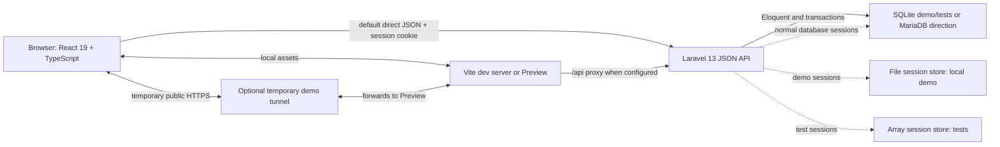

# Architecture

**Status:** Current implementation reference

**Repository baseline:** `14adce9508992c03c4249d49308a3841c198f4bd`

## High-Level Architecture



The frontend and backend are separate applications. Laravel is the security and persistence boundary; React is not authoritative for permissions or financial state.

## Backend Structure

- `routes/api.php`: 35 non-vendor API routes and manually assembled cookie/session middleware.
- `app/Http/Controllers/Api/`: HTTP orchestration and response payloads.
- `app/Http/Requests/`: input normalization, validation, and some school/route-model authorization.
- `app/Http/Middleware/EnsureUserHasPermission.php`: permission-slug enforcement.
- `app/Services/FeeAgreements/`: agreement creation and superseding transactions.
- `app/Services/Billing/`: Fee Record generation/summary, payment, receipt, numbering, and legacy invoice services.
- `app/Services/Audit/` and `app/Audit/`: audit event foundation.
- `app/Models/`: Eloquent entities and relationships.
- `database/migrations/`: schema history and corrective migrations.
- `database/seeders/`: demo school, users, roles, permissions, fees, and scenarios.

There is no `app/Policies` directory. Authorization is primarily route middleware plus distributed school-scope checks in controllers, requests, and services.

## Frontend Structure

- `src/App.tsx`: authentication state, navigation state, Dashboard, Student Detail, finance workspaces, summary pages, prototypes, and most API orchestration.
- `src/api.ts`: credentialed JSON `fetch`, normalized API errors, and validation-error parsing.
- `src/components/AdminShell.tsx` and `AdminUi.tsx`: shell and shared administrative UI primitives.
- `src/components/CalendarPage.tsx`: calendar workflow and permission visibility.
- `src/components/ClassesPage.tsx`: read-only class directory and rosters.
- `src/features/fee-agreements/`: Fee Agreement editor and form model.
- `src/features/payments/`: payment allocation editor and allocation model.

The application does not use React Router, Redux, React Query, or another global data layer. Page selection is component state, so there are no deep links or browser-history routes. Data fetching uses local state/effects and the shared API wrapper.

## Authentication Flow

1. `POST /api/login` receives username/password.
2. `LoginRequest` trims and lowercases the username and validates its format.
3. Laravel's `web` session guard checks the password.
4. A successful login regenerates the session ID; a non-`active` user is immediately logged out.
5. `/api/me` restores the user and returns role slugs plus the union of role permissions.
6. The browser sends cookies with `credentials: include`.
7. Logout invalidates the session and regenerates its token.

Configuration defaults include an eight-hour session lifetime, database sessions outside tests, `HttpOnly` cookies, SameSite `lax`, environment-controlled secure cookies, and no session payload encryption.

Security limitations:

- Login throttling is not configured on the login route.
- The manually assembled API session middleware does not include CSRF verification, and the frontend does not obtain/send a CSRF token. Deployment safety is **Not verified**.
- User status is checked at login, not on every authenticated request.

## Authorization Flow

Standard protected request flow:

```text
cookie/session middleware
  -> auth
  -> permission:<slug>
  -> request/controller/service school-scope checks
  -> domain transaction
```

`User::hasPermissionTo()` resolves permissions through the user's roles. Frontend `permissions.includes(...)` checks hide many actions or suppress requests, but the complete navigation remains visible for every logged-in role.

Known exception: `/api/dashboard/school` and `/api/invoices/generate-monthly` use only `auth`. Their controllers do not bind the requested school/actor to the authenticated user. This is an unresolved backend authorization gap, not a frontend concern.

## Request and Validation Flow

- Form Requests validate most mutation payloads and normalize selected values.
- Route permission middleware rejects missing permissions with HTTP 403.
- Controllers load school-scoped records or delegate to services.
- Financial services use transactions and row locks where sequencing or concurrent balances matter.
- Laravel renders exceptions as JSON for `api/*` requests and adds the request UUID header when available.

Form Request `authorize()` commonly returns `true`; the route permission and later scope checks remain essential. Validation rules and persisted strings are not always backed by database enums/checks.

## Domain Logic Placement

- Fee Agreement versioning belongs in `FeeAgreementVersioningService`.
- Fee Record generation/manual charge/summary/category logic belongs under `Services/Billing`.
- Payment allocation, verification, and void reversal belong in `PaymentRecordingService`.
- Receipt eligibility, snapshots, voiding, and number sequencing belong in `ReceiptGenerationService` and `ReceiptNumberService`.
- Legacy monthly invoice generation remains separate and is not the active Fee Record source of truth.

Controllers should not duplicate these invariants. New financial mutations should be transactionally implemented and later integrated with audit logging in the same transaction.

## API Conventions

- API base path: `/api`.
- JSON requests/responses with Laravel validation errors (HTTP 422).
- Authentication failures use 401; permission failures use 403.
- Resource payloads frequently use a named top-level key; lists may use `data` plus metadata.
- Route models and explicit integer IDs are both present; conventions are not completely uniform.
- No API version prefix is implemented.

## Error Handling

The frontend API client preserves backend messages/validation details for non-5xx responses and replaces server failures with a generic service-unavailable message. Page components handle loading, empty, permission, and error states with varying completeness. Session restoration failures currently return the user to the login screen even when the failure is not 401.

## Audit Architecture

Implemented foundation:

- UUIDv7 request IDs and `X-Request-ID` response header.
- Typed audit action/module/context objects.
- Secret-key payload sanitization.
- Central `AuditLoggerContract`/`AuditLogger` binding.
- Secure audit columns, indexes, event UUID uniqueness, legacy backfill, and Eloquent instance immutability.
- `audit.view` and `audit.correct_generic` permissions seeded only to Super Admin.

Planned, not implemented:

- Calls from authentication, student, agreement, charge, payment, receipt, user-management, and correction workflows.
- Audit query/detail/export routes and an Audit Trail frontend.
- Generic correction workflow and business-specific recovery operations.
- Verified production runtime database grants and restored-backup reconciliation.

Model guards do not prevent query-builder/raw SQL/DBA mutation. Production least-privilege requirements are in [Audit Log Operations](AUDIT_LOG_OPERATIONS.md).

## External Services

No external business API, payment gateway, email provider, object storage service, analytics service, or identity provider is integrated. Laravel mail defaults to logging in the example environment.

`tools/public-demo/` can download a pinned/checksummed `cloudflared` executable and expose Vite Preview through a temporary Quick Tunnel. This is demo-only and not a production dependency.

## Deployment Assumptions

The repository contains no CI workflow, Docker image, Nginx configuration, infrastructure-as-code, production hosting configuration, or monitoring setup. A real deployment must separately provide HTTPS, secure cookie/proxy configuration, MariaDB, restricted runtime credentials, migrations, queues if used, backups, restore testing, logging, and monitoring.

**Not verified:** Any deployed environment or production readiness.

## Related Documentation

- [Project Overview](project-overview.md)
- [Business Rules](business-rules.md)
- [Database](database.md)
- [Permissions](permissions.md)
- [Current Status](current-status.md)
