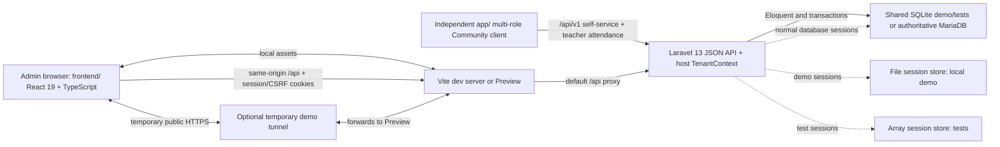

# Architecture

**Status:** Current implementation reference

**Repository baseline:** Role and User Abilities delivery (2026-08-23)

## Tenant Boundary

The shared backend resolves an active tenant from an explicitly verified request hostname before authentication and business authorization. `TenantContext` contains tenant and surface; active membership then supplies tenant-specific roles and permitted schools. Client-supplied tenant IDs are not authoritative. Each school belongs to one tenant and existing business records continue to inherit tenant ownership through `school_id`.

Admin (`frontend/`) and App (`app/`) are separate builds on separate tenant domains. Each calls `/api/tenant-context`, rejects the wrong surface, and uses same-origin `/api` session/CSRF requests. See [SaaS Multi-Tenancy](saas-multitenancy.md).

Every tenant runs the same Admin and App source builds and the same Laravel backend. Tenant variation is limited to host-resolved `branding` and `features`; tenant-specific frontend copies, tenant branches, and tenant-specific authorization behavior are outside the architecture.

Laravel's `tenant.surface` middleware is the authoritative browser-surface boundary. Admin/platform/tenant-management and legacy finance APIs require `admin`; Community, Teacher, Assessment, Quiz and Portal APIs require `app`; tenant context and session bootstrap/authentication remain shared. A surface mismatch returns 404 and does not replace membership, permission, feature, school or resource authorization.

`UserPermissionResolver` is authoritative for middleware and `/api/me`. It combines active tenant-membership position defaults with same-school explicit grants/denials in `user_permission_overrides`; platform owners bypass school permission lookup. `EmployeeAccessService` locks the target, synchronizes legacy and membership position roles, materializes overrides, and writes required audit records in one transaction.

The App has three personas only: Teacher, Parent, and Student. `app.teacher_access` admits an elevated employee as Teacher, while school-wide tools retain their own permission gates and App-surface endpoints. Multi-persona users make an explicit first-use choice that is remembered on the device.

## High-Level Architecture



The Admin frontend, multi-role Community App, and backend are separate applications. Laravel remains the shared security and persistence boundary; neither React client is authoritative for permissions or financial state. Both clients reuse the same API, database, identity/RBAC, and domain services rather than creating a second mobile backend.

## Community Safety Boundary

Community contribution always follows host-resolved tenant, active membership, permission and school/audience scope. The client never submits a tenant or school ID for policy acceptance, reporting, blocking, moderation or appeals. Laravel is authoritative for policy versions, adult authorization, restrictions, visibility and state transitions.

Ordinary contributions enter `pending_review`; authorized moderators may publish directly. Media remains quarantined until approval. Reports snapshot evidence transactionally; severe child-safety, sexual-content and violence categories quarantine content immediately. School moderators cannot access another school. Platform detail is limited to severe or explicitly escalated cases and access is audited.

The App exposes public `/legal/*` routes backed by a no-session public API. Responses contain effective policy sections, tenant presentation and configured support contacts only—never report, reporter or evidence data.

## Backend Structure

- `routes/api.php`: JSON API routes with manually assembled cookie, session, and native CSRF middleware.
- `app/Http/Controllers/Api/`: HTTP orchestration and response payloads.
- `app/Http/Requests/`: input normalization, validation, and some school/route-model authorization.
- `app/Http/Middleware/EnsureUserHasPermission.php`: permission-slug enforcement.
- `app/Http/Middleware/EnsureUserIsActive.php`: rechecks user status for every authenticated API request.
- `app/Support/SchoolScopeResolver.php`: trusted school resolution for the dashboard and legacy invoice workflow.
- `app/Support/SchoolContext.php` and `ResolveSchoolContext`: consistent school resolution for new Phase A `/api/v1` modules.
- `app/Policies/`: Phase A academic and portal-link resource authorization.
- `app/Services/Foundation/`: academic foundation, teacher scope, portal-link, and minimum foundation-account transactions.
- `app/Services/Attendance/`: teaching-assignment-scoped class Attendance, append-only campus movements, guardian notifications, time-bound abilities, and transactional audit.
- `app/Services/FeeAgreements/`: agreement creation and superseding transactions.
- `app/Services/Billing/`: Fee Record generation/summary, payment, receipt, numbering, manual in-app payment reminders, and legacy invoice services.
- `app/Services/Audit/` and `app/Audit/`: audit events, trusted context, sanitization, and persistence.
- `app/Services/Operations/ApplicationLogReader.php`: bounded read-only parsing, filtering, normalization, pagination, and sanitization for Laravel application logs.
- `app/Models/`: Eloquent entities and relationships.
- `database/migrations/`: schema history and corrective migrations.
- `database/seeders/`: demo school, users, roles, permissions, fees, and scenarios.

Legacy authorization remains primarily route middleware plus distributed scope checks. New Phase A modules use policies/access services and `SchoolContext`; this is the required pattern for future mobile/self-service modules.

## Frontend Structure

- `src/App.tsx`: authentication state, permission-filtered navigation, Dashboard, Student Detail, finance workspaces, summary pages, and most API orchestration.
- `src/api.ts`: same-origin credentialed JSON `fetch`, CSRF bootstrap/header/retry behavior, normalized API errors, and validation-error parsing.
- `src/components/AdminShell.tsx` and `AdminUi.tsx`: shell and shared administrative UI primitives.
- `src/components/CalendarPage.tsx`: calendar workflow and permission visibility.
- `src/components/ClassesPage.tsx`: read-only class directory and rosters.
- `src/features/fee-agreements/`: Fee Agreement editor and form model.
- `src/features/payments/`: payment allocation editor and allocation model.
- `src/features/audit/`: read-only Audit Trail list, filters, cursor pagination, and detail view.
- `src/features/logs/`: Super Admin-only sanitized Application Logs summary, filters, pagination, and expandable context.

The application does not use React Router, Redux, React Query, or another global data layer. Page selection is component state, so there are no deep links or browser-history routes. Data fetching uses local state/effects and the shared API wrapper.

The Admin Sidebar uses MAW-style navigation behavior with MIS branding: standalone primary destinations, icon-led accordion module groups, indented text subitems, a full desktop slide-away control, and the existing mobile drawer. Group and desktop-collapse preferences are local presentation state only; they never replace backend authorization.

`frontend/` and `app/` are independent React workspaces. Admin and the Community App are built and deployed separately on different domains, while each domain reverse-proxies its own `/api` path to the same Laravel backend. This same-origin browser topology preserves the existing session-cookie and CSRF model. A native workspace and store packaging do not exist yet.

The approved App direction adds a Teacher/Staff mobile mode without turning `app/` into an administrative back door. Community publication is school/class-audience scoped; attendance and academic mutations remain teaching-assignment scoped; Parent/Student reads remain guardian-child or student-self scoped. Admin moderation and broad operational management remain in `frontend/`.

## Authentication Flow

1. The frontend obtains `/api/csrf-cookie` before a mutation when no `XSRF-TOKEN` cookie is present and sends the decoded value in `X-XSRF-TOKEN`.
2. `POST /api/login` receives username/password through native request-forgery protection.
3. `LoginRequest` trims and lowercases the username and validates its format.
4. Login attempts are limited to five per 60 seconds by normalized username plus client IP. Successful login clears the limiter key.
5. Laravel's `web` session guard checks the password. A successful login regenerates the session ID; a non-`active` user receives the same generic failure as bad credentials.
6. `/api/me` restores the user and returns role slugs plus the union of role permissions.
7. `EnsureUserIsActive` reloads status on authenticated requests; deactivation invalidates an existing session and returns 401.
8. Logout invalidates the session and regenerates its token.

Configuration defaults include an eight-hour session lifetime, database sessions outside tests, `HttpOnly` cookies, SameSite `lax`, environment-controlled secure cookies, and no session payload encryption.

Deployment limitations remain: secure-cookie flags, trusted proxy behavior, CORS, shared rate-limit/session storage, HTTPS termination, and multi-instance topology are environment-specific and **Not verified**.

Mobile Web must initially preserve the reviewed browser session/CSRF model. Native authentication is a later security decision; Sanctum is only a candidate for separate evaluation and is not currently installed. Custom JWT authentication is not an approved direction.

## Authorization Flow

Standard protected request flow:

```text
cookie/session middleware
  -> CSRF verification for mutations
  -> auth
  -> active-user check
  -> permission:<slug>
  -> request/controller/service school-scope checks
  -> domain transaction
```

`User::hasPermissionTo()` resolves permissions through the user's roles. Frontend navigation and actions use the returned permission slugs for usability, while backend middleware remains authoritative. Dashboard and monthly invoice routes now require `fee_record.view` and `fee_record.generate` respectively and resolve school/actor from trusted context.

New Phase A modules use a consistent chain under `/api/v1`: authenticated active user, permission middleware, `ResolveSchoolContext`, resource policy/access service, school-scoped query, and transactional domain service. Self-service callers do not provide their own school scope. Legacy endpoints retain their current distributed checks and can migrate incrementally.

Teacher roster access requires an active/current teaching assignment matching the authenticated teacher, school, academic year, class, and subject. Portal identity linking requires exact same-school users with the required role; it never uses guessed personal-data matching.

Class Attendance uses current teaching scope. A Teacher can create or update one `daily` session for an assigned class/date; time-bound abilities can separately broaden school visibility or management. Campus Attendance is an independent append-only entry/exit stream and does not silently create lesson/class decisions. Admin endpoints remain behind the Admin surface, resolved school context, tenant feature, and dedicated permission middleware. Parent campus/class reads require an active guardian-child link with `can_view_academics = true`; Student Attendance is not exposed. React role visibility is not the authorization boundary.

Gate entry is currently an authenticated Admin API integration, not a public hardware endpoint. It serializes daily-session creation by class, leaves the session `in_progress`, and treats repeated student/session scans as idempotent. Device-signature authentication, replay protection, and exit-event processing are **Planned, not implemented**.

## Request and Validation Flow

- Form Requests validate most mutation payloads and normalize selected values.
- Route permission middleware rejects missing permissions with HTTP 403.
- Controllers load school-scoped records or delegate to services.
- Financial services use transactions and row locks where sequencing or concurrent balances matter.
- Tenant-owned fee items, allocations, classes, and selected discount items are validated against the resolved school before persistence.
- Laravel renders exceptions as JSON for `api/*` requests and adds the request UUID header when available.

Form Request `authorize()` commonly returns `true`; the route permission and later scope checks remain essential. Validation rules and persisted strings are not always backed by database enums/checks.

## Domain Logic Placement

- Fee Agreement versioning belongs in `FeeAgreementVersioningService`.
- Fee Record generation/manual charge/summary/category logic belongs under `Services/Billing`.
- Payment allocation, verification, and void reversal belong in `PaymentRecordingService`.
- Receipt eligibility, snapshots, voiding, and number sequencing belong in `ReceiptGenerationService` and `ReceiptNumberService`.
- Legacy monthly invoice generation remains separate and is not the active Fee Record source of truth.
- Fee Record activation and manual charges own their transactions and required audit inserts.

Controllers should not duplicate these invariants. New material financial mutations must write an allowlisted audit event inside the same transaction.

## API Conventions

- API base path: `/api`.
- JSON requests/responses with Laravel validation errors (HTTP 422).
- Authentication failures use 401; permission/school-scope failures use 403; conflicting charge history uses 409; CSRF mismatch uses 419; login throttling uses 429.
- Resource payloads frequently use a named top-level key; lists may use `data` plus metadata.
- Route models and explicit integer IDs are both present; conventions are not completely uniform.
- Existing legacy routes use `/api`; new foundation and future self-service modules use `/api/v1`.

## Error Handling

The frontend API client preserves backend messages/validation details for non-5xx responses and replaces server failures with a generic service-unavailable message. Page components handle loading, empty, permission, and error states with varying completeness. Session restoration failures currently return the user to the login screen even when the failure is not 401.

## Audit Architecture

Implemented:

- UUIDv7 request IDs and `X-Request-ID` response header.
- Typed audit action/module/context objects.
- Secret-key payload sanitization.
- Central `AuditLoggerContract`/`AuditLogger` binding.
- Secure audit columns, indexes, event UUID uniqueness, legacy backfill, and Eloquent instance immutability.
- Required transactional events for student create/update/status, agreement create/supersede, Fee Record activation/manual charges, payment record/verify/void, receipt issue/void, and manual payment-reminder send.
- Required transactional events for daily attendance submission and correction.
- Best-effort login success/failure/logout events with a dedicated redacted security-log fallback if audit storage fails.
- `GET /api/audit-logs` and `GET /api/audit-logs/{auditLog}` with validated filters, stable cursor pagination, output re-sanitization, and `audit.view` backend enforcement.
- A permission-visible, read-only Audit Trail UI for Super Admin.
- `audit.view` and `audit.correct_generic` permissions seeded only to Super Admin; correction is not implemented.

Planned, not implemented:

- Generic correction workflow, audit export, and business-specific recovery operations.
- Events for future user management, reports/exports, refunds, credits, write-offs, and other workflows that do not currently exist.
- Verified production runtime database grants and restored-backup reconciliation.

Model guards do not prevent query-builder/raw SQL/DBA mutation. Production least-privilege requirements are in [Audit Log Operations](AUDIT_LOG_OPERATIONS.md).

## Application Log Viewer

`GET /api/application-logs` is a read-only Admin-surface endpoint protected by `logs.view`, which is assigned only to Super Admin by the migration and demo seeder. `ApplicationLogReader` reads only `laravel*.log` files from the configured log directory, parses single-line Laravel events, normalizes levels to `INFO`, `WARN`, `ERROR`, or `FATAL`, caps the in-memory result set, and applies validated filters and pagination.

The response runs structured context through the existing audit payload sanitizer and redacts credential-like assignments from message text. Multiline stack-trace continuation lines, security-channel files, raw request bodies, headers, cookies, credentials, and tokens are not returned. The viewer is operational diagnostics; business actor/change history remains authoritative only in Audit Trail.

## External Services

No external business API, payment gateway, email provider, object storage service, analytics service, or identity provider is integrated. Laravel mail defaults to logging in the example environment.

Firebase/FCM, APNs, and device registration are approved only as later push-delivery concepts. No integration, credential, device-token storage, or delivery runtime is implemented.

`tools/public-demo/` can download a pinned/checksummed `cloudflared` executable and expose Vite Preview through a temporary Quick Tunnel. This is demo-only and not a production dependency.

## Deployment Assumptions

The repository now contains GitHub Actions qualification source, a pinned PHP-FPM image, an internal Nginx application configuration, generic Docker Compose definitions for a private MariaDB service and isolated staging/production application stacks, non-secret environment contracts, and immutable release tooling. The implemented topology is described in [Deployment Foundation](deployment-foundation.md).

No real VPS, Docker runtime, edge TLS/Basic Auth, remote release directories, production database, backup destination, restore drill, or monitoring service is verified. A real deployment must still provide HTTPS and exact proxy trust, private secret files, migrations with separate identities, automatic staging delivery, manual exact-artifact production promotion, backup/recovery, logging, and alerts.

**Not verified:** Any deployed environment or production readiness.

## Related Documentation

- [Project Overview](project-overview.md)
- [Business Rules](business-rules.md)
- [Database](database.md)
- [Permissions](permissions.md)
- [Current Status](current-status.md)
- [Deployment Foundation](deployment-foundation.md)
- [Mobile Product Architecture and Roadmap](mobile-product-roadmap.md)
