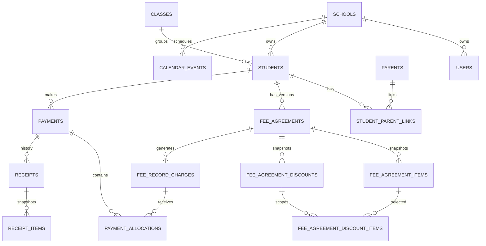

# Database

**Status:** Current schema reference

**Repository baseline:** Phase A delivery branch through `a5f4fb4`

## Engines and Configuration

- Intended production direction: MariaDB/MySQL-compatible relational database.
- Repository default: SQLite in `backend/.env.example` and `config/database.php`.
- Automated PHPUnit default: SQLite `:memory:` enforced by `backend/phpunit.xml`.
- MariaDB connection: `utf8mb4`, `utf8mb4_unicode_ci`, strict mode.

SQLite success does not prove MariaDB JSON, indexes, DDL, foreign keys, row locks, or concurrency behavior. Use the guarded disposable MariaDB workflow in [Testing and Release](testing-and-release.md).

The schema has no currency column and amount-to-words currently assumes Ringgit. **Needs confirmation:** Whether the system will remain MYR-only.

## Schema Inventory

The migrated schema contains 40 tables.

| Area | Tables |
| --- | --- |
| Laravel infrastructure | `migrations`, `sessions`, `cache`, `cache_locks`, `jobs`, `job_batches`, `failed_jobs` |
| School and access | `schools`, `users`, `roles`, `permissions`, `user_roles`, `role_permissions`, `audit_logs` |
| Students and contacts | `classes`, `students`, `parents`, `student_parent_links` |
| Legacy fee setup | `fee_items`, `discount_items`, `student_fee_assignments`, `student_discount_assignments` |
| Fee Agreements | `fee_agreements`, `fee_agreement_items`, `fee_agreement_discounts`, `fee_agreement_discount_items` |
| Fee Record and legacy invoices | `fee_record_charges`, `invoice_sequences`, `invoices`, `invoice_items` |
| Payments and receipts | `payments`, `payment_allocations`, `receipt_sequences`, `receipts`, `receipt_items` |
| School operations | `calendar_events` |
| Academic foundation | `academic_years`, `class_enrolments`, `subjects`, `teaching_assignments` |

## Main Relationships

The diagram omits secondary actor, fee-item, legacy invoice, permission, and audit references for readability. Migrations remain authoritative.

## Foreign-Key and Retention Behavior

- Student and core finance ownership normally uses `RESTRICT` from agreements, charges, payments, receipts, and invoices to prevent casual deletion.
- Optional catalog/actor references commonly use `SET NULL` so snapshots survive deletion of a referenced user or fee item.
- School deletion cascades through many owned records. There is no application school-delete workflow, but database-level deletion of a school would be highly destructive.
- Agreement items/discount children cascade with their agreement; application workflows preserve agreements through versioning rather than deletion.
- Payment allocations cascade with a payment. There is no application payment-delete route.
- Receipt items cascade with a receipt. There is no application receipt-delete route.
- `audit_logs.entity_type/entity_id` and `related_audit_id` are logical references, not foreign keys.

No model uses soft deletes. Historical preservation is implemented through status, version, supersede, and void workflows, not `deleted_at`.

## Important Unique Constraints and Indexes

Verified uniqueness includes:

- `schools.code`; `users.username`; role and permission slugs.
- Role/user and role/permission pivot pairs.
- `(school_id, name)` for classes and fee/discount item names.
- `(school_id, student_no)` for students.
- `(school_id, code)` for fee items.
- `(school_id, student_id, academic_year, version_no)` for Fee Agreement versions.
- `(school_id, student_id, academic_year, current_slot)` for at most one current Fee Agreement; historical rows have nullable `current_slot`.
- Fee Agreement discount/item pivot pairs.
- Legacy `(school_id, invoice_no)` and `(school_id, student_id, invoice_month)`.
- Receipt sequence `(school_id, prefix, series)`.
- Receipt number `(school_id, receipt_no)`.
- Issued-receipt guard `(school_id, active_payment_id)`; voiding clears `active_payment_id`, preserving history while allowing regeneration.
- `audit_logs.event_uuid`.
- `(school_id, fee_agreement_item_id, billing_month)` for scheduled agreement-item Fee Record charges. Nullable agreement-item IDs keep separate manual charges possible.

Important lookup indexes cover student status/class/level, agreement current lookup, Fee Record student/category/agreement-item month, payment date/student/status/reference, payment allocation targets, receipt payment/student/date/status, audit request/batch/module/action/time, and calendar school/start.

Phase A adds nullable unique `parents.user_id` and `students.user_id` references without backfill. Guardian access/history fields are nullable for existing unreviewed links. The current enrolment unique key is `(school_id, academic_year_id, student_id, current_slot)`; historical rows use `NULL`. Teaching assignments use the equivalent nullable-current-slot pattern across school/year/class/subject/teacher.

## Future Mobile Data Boundary

The approved mobile product does not introduce a second database or duplicate parent, student, identity, finance, payment, or receipt tables. Future mobile APIs reuse the existing MariaDB records and domain services.

Parent Finance must continue to derive outstanding amounts from `fee_record_charges` and verified payment allocations. A separate mobile balance table or `fee_installments` ledger is not approved for V1.

The experimental portal adds `portal_notifications`, scoped by `school_id` and `recipient_user_id`, with JSON context and nullable read time. It does not add device tokens or push delivery. Later phases may add device and quiz tables only through separately reviewed additive migrations. Planned Quiz concepts remain flexible class/direct-student targets and materialized quiz recipients; their final keys, retention, and rollback behavior require MariaDB-specific review before implementation.

The first Attendance slice adds `attendance_sessions` and `attendance_records` through an additive migration. Sessions are school/year/class scoped and use a school-unique key such as `daily:2026-08-12:class:4`; the general columns also leave room for later `lesson` and `event` sessions. Records enforce one row per session/student, use `present`, `late`, `absent`, or `excused`, retain the original marker, and preserve correction actor/reason/time. No historical attendance is inferred or backfilled.

Other approved future App data domains include community posts/audiences/media/reactions/comments and academic terms/assessments/published results. These still require additive migrations, explicit school/relationship constraints, tested rollback order, and no inferred historical backfill. Approval of the product model does not imply that those tables already exist.

Known integrity gaps:

- Most status columns are unconstrained strings rather than enums/checks.
- Actor `user_id` and financial row `school_id` are not protected by composite foreign keys.

## Financial Columns

All schema money/value fields use `DECIMAL(10,2)`, including fee/discount values, agreement amounts, Fee Record expected/paid/outstanding caches, legacy invoice totals, payment/allocation amounts, and receipt/item amounts.

Application caveat:

- Active Fee Agreement item/discount, Fee Record, payment/allocation, and receipt/item models cast persisted amounts as `decimal:2`.
- Input validation limits newly hardened financial requests to `99,999,999.99` and at most two decimal places; payment allocation equality is compared in cents.
- Legacy assignment/invoice models and some reporting conversions still use PHP floating-point values.

Therefore, do not claim end-to-end decimal safety. New financial logic should use an explicit decimal/cents strategy and tests.

## Status and Classification Fields

| Entity | Values verified in request/service behavior |
| --- | --- |
| Student | `active`, `withdraw`, `graduate`, `inactive` |
| Fee Agreement | service writes `active`, `superseded`; migration default is `draft` |
| Payment plan | API allows `monthly`, `termly`, `yearly`; a demo scenario also contains `custom` |
| Item classification | `recurring`, `optional_service`, `one_time`, `manual` |
| Billing frequency | `monthly`, `termly`, `yearly`, `custom`, `one_time` |
| Discount | types `percentage`, `fixed_amount`; scopes `tuition_only`, `total_payable`, `selected_fee_items` |
| Fee Record | billing `billable`, `no_charge`; collection `unpaid`, `partial`, `paid`; origin `scheduled`, `manual` |
| Allocation | `charge`, `manual`, `legacy` |
| Payment | `pending_verification`, `verified`, `voided` |
| Receipt | `issued`, `voided` |
| Calendar type | `appointment`, `training`, `meeting`, `school_event`, `other` |
| Attendance session | current UI writes `daily`; schema is prepared for later `lesson`, `event` |
| Attendance record | `present`, `late`, `absent`, `excused` |

The `custom` demo payment plan cannot be submitted through the current agreement API. This is a known data/API inconsistency.

## Historical and Immutable Data

- Superseding an agreement creates a new header and child snapshots; earlier versions remain.
- Receipts snapshot student/payer/method/date/line descriptions/amounts so optional source references may later become null without losing printed history.
- Receipt sequence counters only move forward. Voids do not reuse numbers.
- Payment and receipt voids retain the original rows and actor/time/reason fields.
- Audit secure migrations preserve legacy rows and backfill only missing secure values.
- `AuditLog` prevents ordinary existing-instance update/delete/increment operations. It does not block raw SQL or privileged database users.

## Migration Strategy

- Treat committed migrations as historical records that may already have run.
- Use new corrective migrations for deployed schema changes.
- Preserve data and make forward/backward behavior explicit.
- Order new foreign keys after referenced tables exist and reverse drop order in `down()`.
- A `down()` method is not automatically data-safe; test and document what it destroys.
- Never run `migrate:fresh` against a database containing data.

The payment-allocation agreement-item foreign key is now created by the later corrective migration `2026_06_30_000006_ensure_payment_allocation_fee_agreement_item_foreign_key.php`, after `fee_agreement_items` exists. Older documentation describing the original fresh-MariaDB ordering defect is stale. On 2026-08-03, the documentation task successfully ran fresh/one-step rollback/re-migration and the guarded 8-test/33-assertion group on a disposable MariaDB 11.4.12 instance. This is local schema evidence, not production compatibility proof.

`2026_08_03_000001_add_financial_integrity_constraints.php` adds the current-agreement and scheduled-charge unique keys. Its `up()` preflights duplicate current agreements and duplicate scheduled charges and aborts with an explicit error rather than deleting or choosing data. Its `down()` removes those constraints and `current_slot`; release rollback must account for the resulting loss of database-level protection.

## Rollback Expectations and Known Risks

- Creation-migration rollback drops tables and their data.
- Student alignment rollback removes `level_group` but cannot restore statuses normalized to `inactive`.
- The receipt-builder migration rebuilds receipt tables in both directions and is data-destructive.
- The username migration removed staff email/reset data; rollback recreates empty structures and cannot restore previous values.
- Fee Agreement/Fee Record rollbacks remove historical finance data.
- Secure audit rollback removes only the added secure columns/indexes after reversing all three phases; the original audit rows/columns remain. Its backfill migration intentionally has a no-op `down()`.

Do not describe repository-wide rollback as safe. Releases that include schema changes require backups, a tested restore path, and a migration-specific recovery plan.

## MariaDB Considerations

- Use the Laravel `mariadb` driver and a disposable test database.
- Validate native JSON, exact BTREE indexes, foreign-key definitions, migration fresh/rollback/re-migrate, and row-lock/concurrency-sensitive workflows.
- The guarded destructive tests refuse to run unless the database is exactly `matahari_audit_test`, `DB_URL` is empty, the driver is `mariadb`, the server identifies as MariaDB, and explicit opt-in is present.
- MariaDB database identities should separate web runtime, migration, and recovery authority. The web runtime should have only required table privileges; `audit_logs` should be `SELECT, INSERT` only.
- **Not verified:** Production MariaDB version, collation, SQL modes, grants, backups, binary logs, restore, or reconciliation.

## Related Documentation

- [Business Rules](business-rules.md)
- [Architecture](architecture.md)
- [Testing and Release](testing-and-release.md)
- [Mobile Product Architecture and Roadmap](mobile-product-roadmap.md)
- [Audit Log Operations](AUDIT_LOG_OPERATIONS.md)
