# Database

**Status:** Current schema reference

**Repository baseline:** School Information and App Support settings (2026-08-30)

## Engines and Configuration

- Production and development direction: PostgreSQL 18.6 with Laravel's `pgsql` driver.
- Repository default: PostgreSQL in `backend/.env.example` and `config/database.php`.
- PHPUnit defaults to SQLite `:memory:`; full qualification explicitly overrides it and runs the whole suite on PostgreSQL as well.
- Legacy SQLite/MySQL connection definitions remain for compatibility, not the deployment target.

See [PostgreSQL](postgresql.md) for setup, the preserved local-data copy, test-database guards, grants and recovery. SQLite success does not prove PostgreSQL constraints, row locks or concurrency behavior.

The schema has no currency column and amount-to-words currently assumes Ringgit. **Needs confirmation:** Whether the system will remain MYR-only.

## Tenant Foundation

`tenants` owns configuration and one or more `schools`. `tenant_brandings`, `tenant_domains`, and `tenant_features` are tenant-owned configuration. `tenant_user_memberships` joins a global `users` identity to a tenant; `tenant_membership_schools` and `tenant_membership_roles` define the active school and RBAC scope. `users.is_platform_owner` is an explicit platform capability.

The migration is additive and leaves finance/academic ownership on `school_id`. Existing schools are conservatively assigned one generated tenant each; explicit existing `users.school_id` relationships and role assignments are copied to membership records. No production domain, campus grouping, guardian link, portal activation, academic date, or enrolment date is inferred. See [SaaS Multi-Tenancy](saas-multitenancy.md).

The corrective hardening migration requires `schools.tenant_id` and `tenant_membership_schools.tenant_id`. Composite foreign keys enforce that membership default/allowed schools share the membership tenant. A generated nullable `tenant_domains.primary_surface` and unique `(tenant_id, primary_surface)` key enforce at most one primary domain per tenant/surface. The migration is safe to retry after partial MariaDB DDL and preflights inconsistent legacy rows before applying constraints.

## Schema Inventory

The role/Attendance delivery adds `user_permission_overrides`, campus Attendance device/settings/event storage, and historical time-window Attendance abilities. Recount the disposable schema during release checks instead of relying on the older 61-table snapshot below.

| Area | Tables |
| --- | --- |
| Laravel infrastructure | `migrations`, `sessions`, `cache`, `cache_locks`, `jobs`, `job_batches`, `failed_jobs` |
| Tenant, school and access | `tenants`, `tenant_brandings`, `tenant_domains`, `tenant_features`, `tenant_user_memberships`, `tenant_membership_schools`, `tenant_membership_roles`, `schools`, `school_support_settings`, `users`, `roles`, `permissions`, `user_roles`, `role_permissions`, `user_permission_overrides`, `audit_logs` |
| Students and contacts | `classes`, `students`, `parents`, `student_parent_links` |
| Legacy fee setup | `fee_items`, `discount_items`, `student_fee_assignments`, `student_discount_assignments` |
| Fee Agreements | `fee_agreements`, `fee_agreement_items`, `fee_agreement_discounts`, `fee_agreement_discount_items` |
| Fee Record and legacy invoices | `fee_record_charges`, `invoice_sequences`, `invoices`, `invoice_items` |
| Payments and receipts | `payments`, `payment_allocations`, `receipt_sequences`, `receipts`, `receipt_items` |
| School operations | `calendar_events` |
| Academic foundation | `academic_years`, `class_enrolments`, `subjects`, `teaching_assignments` |
| Portal notifications and Attendance | `portal_notifications`, `notification_destinations`, `attendance_sessions`, `attendance_records`, `campus_attendance_events`, `attendance_devices`, `attendance_settings`, `user_attendance_abilities` |
| School Updates and historical Community storage | `community_posts`, `community_post_audiences`, `community_post_media`, `community_post_reactions`, `community_comments` |
| Post Reports and historical Community safety storage | `community_policy_versions`, `community_policy_acceptances`, `community_reports`, `community_report_actions`, `community_user_blocks`, `community_user_restrictions`, `community_appeals`, `student_community_authorizations` |
| Assessments | `academic_terms`, `assessments`, `assessment_class_targets`, `assessment_results` |
| Quiz | `quizzes`, `quiz_questions`, `quiz_options`, `quiz_assignments`, `quiz_assignment_class_targets`, `quiz_assignment_student_targets`, `quiz_assignment_recipients`, `quiz_attempts`, `quiz_attempt_answers` |

### User permission overrides

`user_permission_overrides` is unique by `(school_id, user_id, permission_id)` and stores `allowed`, the required reason, updating actor, and timestamps. `false` denies a position default; `true` grants an additional school ability. Rows are stored only when the desired result differs from the position template. Cross-school rows do not contribute to effective permissions.

### School information and App Support

`schools` retains the institutional name/address/phone/email and adds nullable `registration_number`, `group_member_line`, and `operating_hours`. `school_support_settings` has exactly one optional row per school and stores nullable call phone, WhatsApp phone, support email, support hours, last updating user, and timestamps. No invented backfill is created. School deletion cascades the support row; deletion of the updating user sets `updated_by` null.

## Main Relationships

```mermaid
erDiagram
    SCHOOLS ||--o{ USERS : owns
    SCHOOLS ||--o| SCHOOL_SUPPORT_SETTINGS : configures
    SCHOOLS ||--o{ STUDENTS : owns
    CLASSES ||--o{ STUDENTS : groups
    STUDENTS ||--o{ STUDENT_PARENT_LINKS : has
    PARENTS ||--o{ STUDENT_PARENT_LINKS : links
    STUDENTS ||--o{ FEE_AGREEMENTS : has_versions
    FEE_AGREEMENTS ||--o{ FEE_AGREEMENT_ITEMS : snapshots
    FEE_AGREEMENTS ||--o{ FEE_AGREEMENT_DISCOUNTS : snapshots
    FEE_AGREEMENT_DISCOUNTS ||--o{ FEE_AGREEMENT_DISCOUNT_ITEMS : scopes
    FEE_AGREEMENT_ITEMS ||--o{ FEE_AGREEMENT_DISCOUNT_ITEMS : selected
    FEE_AGREEMENTS ||--o{ FEE_RECORD_CHARGES : generates
    FEE_RECORD_CHARGES ||--o{ PAYMENT_ALLOCATIONS : receives
    STUDENTS ||--o{ PAYMENTS : makes
    PAYMENTS ||--o{ PAYMENT_ALLOCATIONS : contains
    PAYMENTS ||--o{ RECEIPTS : history
    RECEIPTS ||--o{ RECEIPT_ITEMS : snapshots
    SCHOOLS ||--o{ CALENDAR_EVENTS : schedules
    STUDENTS ||--o{ CLASS_ENROLMENTS : history
    CLASSES ||--o{ CLASS_ENROLMENTS : receives
    USERS ||--o{ TEACHING_ASSIGNMENTS : teaches
    CLASSES ||--o{ ATTENDANCE_SESSIONS : records
    ATTENDANCE_SESSIONS ||--o{ ATTENDANCE_RECORDS : contains
    STUDENTS ||--o{ ATTENDANCE_RECORDS : receives
    USERS ||--o{ PORTAL_NOTIFICATIONS : receives
    USERS ||--o{ COMMUNITY_POSTS : authors
    COMMUNITY_POSTS ||--o{ COMMUNITY_POST_AUDIENCES : targets
    COMMUNITY_POSTS ||--o{ COMMUNITY_POST_MEDIA : contains
    COMMUNITY_POSTS ||--o{ COMMUNITY_POST_REACTIONS : receives
    COMMUNITY_POSTS ||--o{ COMMUNITY_COMMENTS : receives
    ACADEMIC_YEARS ||--o{ ACADEMIC_TERMS : contains
    ASSESSMENTS ||--o{ ASSESSMENT_RESULTS : records
    QUIZZES ||--o{ QUIZ_QUESTIONS : contains
    QUIZ_QUESTIONS ||--o{ QUIZ_OPTIONS : offers
    QUIZZES ||--o{ QUIZ_ASSIGNMENTS : assigns
    QUIZ_ASSIGNMENTS ||--o{ QUIZ_ASSIGNMENT_RECIPIENTS : materializes
    QUIZZES ||--o{ QUIZ_ATTEMPTS : receives
```

The diagram omits secondary actor, fee-item, legacy invoice, permission, and audit references for readability. Migrations remain authoritative.

## Foreign-Key and Retention Behavior

- Student and core finance ownership normally uses `RESTRICT` from agreements, charges, payments, receipts, and invoices to prevent casual deletion.
- Optional catalog/actor references commonly use `SET NULL` so snapshots survive deletion of a referenced user or fee item.
- School deletion cascades through many owned records. There is no application school-delete workflow, but database-level deletion of a school would be highly destructive.
- Agreement items/discount children cascade with their agreement; application workflows preserve agreements through versioning rather than deletion.
- Payment allocations cascade with a payment. There is no application payment-delete route.
- Receipt items cascade with a receipt. There is no application receipt-delete route.
- `audit_logs.entity_type/entity_id` and `related_audit_id` are logical references, not foreign keys.

Fee Catalogue management preserves `fee_items` rows through the existing `status` field (`active`/`inactive`). The application exposes no Fee Item delete route; changes to catalogue defaults do not rewrite Fee Agreement item, charge, allocation, or receipt snapshots.

No model uses soft deletes. Historical preservation is implemented through status, version, supersede, and void workflows, not `deleted_at`.

## Important Unique Constraints and Indexes

Verified uniqueness includes:

- `(schools.tenant_id, schools.code)`; `users.username`; role and permission slugs.
- `school_support_settings.school_id` for at most one App Support configuration per school.
- `(schools.tenant_id, schools.id)` and `(tenant_user_memberships.tenant_id, tenant_user_memberships.id)` as referenced keys for same-tenant composite foreign keys.
- `(tenant_domains.tenant_id, tenant_domains.primary_surface)` for at most one primary Admin/App/API domain per tenant; non-primary rows produce `NULL` and do not collide.
- Role/user and role/permission pivot pairs.
- `(school_id, name)` for classes and fee/discount item names.
- `(school_id, student_no)` for students.
- `(school_id, code)` for fee items.
- `(school_id, student_id, academic_year, version_no)` for Fee Agreement versions.
- `(school_id, student_id, academic_year, current_slot)` for at most one current Fee Agreement; historical rows have nullable `current_slot`.
- Fee Agreement discount/item pivot pairs.
- Legacy `(school_id, invoice_no)` and `(school_id, student_id, invoice_month)`.
- Receipt sequence `(school_id, prefix, series)`.
- Receipt number `(school_id, receipt_no)`.
- Issued-receipt guard `(school_id, active_payment_id)`; voiding clears `active_payment_id`, preserving history while allowing regeneration.
- `audit_logs.event_uuid`.
- `(school_id, fee_agreement_item_id, billing_month)` for scheduled agreement-item Fee Record charges. Nullable agreement-item IDs keep separate manual charges possible.

Important lookup indexes cover student status/class/level, agreement current lookup, Fee Record student/category/agreement-item month, payment date/student/status/reference, payment allocation targets, receipt payment/student/date/status, audit request/batch/module/action/time, and calendar school/start.

Phase A adds nullable unique `parents.user_id` and `students.user_id` references without backfill. Guardian access/history fields are nullable for existing unreviewed links. The current enrolment unique key is `(school_id, academic_year_id, student_id, current_slot)`; historical rows use `NULL`. Teaching assignments use the equivalent nullable-current-slot pattern across school/year/class/subject/teacher.

School Updates deduplicate each post audience with `(community_post_id, audience_key)` and each user's Like with `(community_post_id, user_id)`. Active publishing creates only `school` or `class` audience rows; historical direct-Student rows remain for compatibility. Assessment results allow one row per `(assessment_id, student_id)`. Formal Quiz assignments preserve separate class and direct-student targets, then deduplicate effective access in `quiz_assignment_recipients` with `(quiz_assignment_id, student_id)`. Quiz attempt numbering is unique per student and materialized `attempt_context_key`, allowing formal assignment attempts and private Practice attempts to share the scoring engine without conflating the products.

## Community App Data Boundary

The approved mobile product does not introduce a second database or duplicate parent, student, identity, finance, payment, or receipt tables. Future mobile APIs reuse the existing PostgreSQL records and domain services.

Parent Finance must continue to derive outstanding amounts from `fee_record_charges` and verified payment allocations. A separate mobile balance table or `fee_installments` ledger is not approved for V1.

Manual payment reminders reuse `portal_notifications`; no tenant-specific reminder or finance database is introduced. Each row stores the resolved school and recipient user plus a child/year/outstanding snapshot in `context_json`. Current balance remains authoritative in Fee Record and is recalculated before sending.

The experimental portal adds `portal_notifications`, scoped by `school_id` and `recipient_user_id`, with JSON context and nullable read time. It does not add device tokens or push delivery.

`notification_destinations` is external operational configuration, not user notification/read-state storage. Nullable `tenant_id` and `school_id` encode exact scope: both null is RYLAY-global, tenant only is tenant-wide, and both set is school-specific. A composite foreign key to `schools(tenant_id, id)` prevents a school destination from crossing tenant ownership; the model also rejects a school without a tenant. `channel`, `destination_type`, `destination_address`, `purpose`, `status`, and optional non-secret JSON `configuration` remain provider-neutral. The table contains no Telegram-specific field, user binding, Bot token, queue/outbox, attempt, or delivery history.

The first Attendance slice adds `attendance_sessions` and `attendance_records` through an additive migration. Sessions are school/year/class scoped and use a school-unique key such as `daily:2026-08-12:class:4`; the general columns also leave room for later `lesson` and `event` sessions. Records enforce one row per session/student, use `present`, `late`, `absent`, or `excused`, retain the original marker, and preserve correction actor/reason/time. `unmarked` means that no row exists. No historical attendance is inferred or backfilled.

Campus Attendance is stored independently as append-only `campus_attendance_events`. Each event preserves school-local date/time, absolute timestamp, student, entry/exit direction, face/card/manual method, optional registered device, source, and external event ID. Device credentials use Laravel's encrypted cast and are hidden from API responses. `attendance_settings` holds one school's arrival/dismissal and guardian notification defaults. `user_attendance_abilities` preserves effective/expiry windows and revocation history rather than deleting grants.

School Updates reuse the Community tables: active posts have explicit school/class audience rows, private image-storage references, one Like per user, and Post Reports. Direct-Student audiences, comments, blocks, restrictions, appeals, and student authorizations are retained only for historical compatibility; active feed responses do not return comments and new publishing does not create direct-Student audiences. Logical withdrawal changes a post to `deleted` and retains its audiences, media references, comments, reactions, reports, report actions, and audit record. `calendar_event_id` is optional so an event post can reuse the authoritative calendar record.

The Assessment foundation stores optional-date academic terms, subject assessments, multiple class targets, and one draft/published result per student. It does not infer terms, dates, historical marks, weights, grade formulas, or publication status.

The Quiz foundation supports `formal` and `practice` records through one question/option/scoring storage engine. `multiple_choice` and `true_false` use the same `quiz_options` table. Published-content history can use `revision_of_id` plus `version_number`; formal assignments retain class targets, direct student targets, and materialized recipients. Attempts keep score snapshots and answer rows. No generation, delivery, scoring, publication, recipient-materialization service, or API is implemented yet, and correct-option columns must never be exposed to an unsubmitted student client.

All 18 new tables are created additively and start empty. There is no historical backfill and no modification to identity, guardian links, enrolments, finance, payments, receipts, or existing role assignments.

Known integrity gaps:

- Most status columns are unconstrained strings rather than enums/checks.
- Actor `user_id` and financial row `school_id` are not protected by composite foreign keys.

Post Report and historical Community-safety rows carry tenant and school ownership, including composite tenant/school foreign-key guards. Reports preserve snapshots, priority, due time, resolution and evidence hold; actions preserve append-only history. Block, restriction, appeal, and student-authorization rows remain historical storage and are not active School Updates workflows. No automatic evidence-retention schedule exists.

## Financial Columns

All schema money/value fields use `DECIMAL(10,2)`, including fee/discount values, agreement amounts, Fee Record expected/paid/outstanding caches, legacy invoice totals, payment/allocation amounts, and receipt/item amounts.

Application caveat:

- Active Fee Agreement item/discount, Fee Record, payment/allocation, and receipt/item models cast persisted amounts as `decimal:2`.
- Input validation limits newly hardened financial requests to `99,999,999.99` and at most two decimal places; payment allocation equality is compared in cents.
- Legacy assignment/invoice models and some reporting conversions still use PHP floating-point values.

Therefore, do not claim end-to-end decimal safety. New financial logic should use an explicit decimal/cents strategy and tests.

## Status and Classification Fields

| Entity | Values verified in request/service behavior |
| --- | --- |
| Student | `active`, `withdraw`, `graduate`, `inactive` |
| Fee Agreement | service writes `active`, `superseded`; migration default is `draft` |
| Payment plan | API allows `monthly`, `termly`, `yearly`; a demo scenario also contains `custom` |
| Item classification | `recurring`, `optional_service`, `one_time`, `manual` |
| Billing frequency | `monthly`, `termly`, `yearly`, `custom`, `one_time` |
| Discount | types `percentage`, `fixed_amount`; scopes `tuition_only`, `total_payable`, `selected_fee_items` |
| Fee Record | billing `billable`, `no_charge`; collection `unpaid`, `partial`, `paid`; origin `scheduled`, `manual` |
| Allocation | `charge`, `manual`, `legacy` |
| Payment | `pending_verification`, `verified`, `voided` |
| Receipt | `issued`, `voided` |
| Calendar type | `appointment`, `training`, `meeting`, `school_event`, `other` |
| Attendance session | current UI writes `daily`; schema is prepared for later `lesson`, `event` |
| Attendance record | `present`, `late`, `absent`, `excused` |

The `custom` demo payment plan cannot be submitted through the current agreement API. This is a known data/API inconsistency.

## Historical and Immutable Data

- Superseding an agreement creates a new header and child snapshots; earlier versions remain.
- Receipts snapshot student/payer/method/date/line descriptions/amounts so optional source references may later become null without losing printed history.
- Receipt sequence counters only move forward. Voids do not reuse numbers.
- Payment and receipt voids retain the original rows and actor/time/reason fields.
- Audit secure migrations preserve legacy rows and backfill only missing secure values.
- `AuditLog` prevents ordinary existing-instance update/delete/increment operations. It does not block raw SQL or privileged database users.

## Migration Strategy

- Treat committed migrations as historical records that may already have run.
- Use new corrective migrations for deployed schema changes.
- Preserve data and make forward/backward behavior explicit.
- Order new foreign keys after referenced tables exist and reverse drop order in `down()`.
- A `down()` method is not automatically data-safe; test and document what it destroys.
- Never run `migrate:fresh` against a database containing data.

The payment-allocation agreement-item foreign key is now created by the later corrective migration `2026_06_30_000006_ensure_payment_allocation_fee_agreement_item_foreign_key.php`, after `fee_agreement_items` exists. Older documentation describing the original fresh-MariaDB ordering defect is stale. On 2026-08-03, the documentation task successfully ran fresh/one-step rollback/re-migration and the guarded 8-test/33-assertion group on a disposable MariaDB 11.4.12 instance. This is local schema evidence, not production compatibility proof.

`2026_08_03_000001_add_financial_integrity_constraints.php` adds the current-agreement and scheduled-charge unique keys. Its `up()` preflights duplicate current agreements and duplicate scheduled charges and aborts with an explicit error rather than deleting or choosing data. Its `down()` removes those constraints and `current_slot`; release rollback must account for the resulting loss of database-level protection.

## Rollback Expectations and Known Risks

- Creation-migration rollback drops tables and their data.
- Student alignment rollback removes `level_group` but cannot restore statuses normalized to `inactive`.
- The receipt-builder migration rebuilds receipt tables in both directions and is data-destructive.
- The username migration removed staff email/reset data; rollback recreates empty structures and cannot restore previous values.
- Fee Agreement/Fee Record rollbacks remove historical finance data.
- Secure audit rollback removes only the added secure columns/indexes after reversing all three phases; the original audit rows/columns remain. Its backfill migration intentionally has a no-op `down()`.
- Tenant-foundation hardening rollback removes its generated primary-surface column, composite foreign keys, referenced-key indexes and membership-pivot tenant column. It preserves every row and retains tenant-local school-code uniqueness; it does not restore the obsolete global school-code index.

Do not describe repository-wide rollback as safe. Releases that include schema changes require backups, a tested restore path, and a migration-specific recovery plan.

## Legacy MariaDB Reference

The following describes the previous engine and retained legacy tests. PostgreSQL is now the required deployment and release target; these commands are not PostgreSQL instructions.

- Use the Laravel `mariadb` driver and a disposable test database.
- Validate native JSON, exact BTREE indexes, foreign-key definitions, migration fresh/rollback/re-migrate, and row-lock/concurrency-sensitive workflows.
- The guarded destructive tests refuse to run unless the database is exactly `rylay_audit_test`, `DB_URL` is empty, the driver is `mariadb`, the server identifies as MariaDB, and explicit opt-in is present.
- MariaDB database identities should separate web runtime, migration, and recovery authority. The web runtime should have only required table privileges; `audit_logs` should be `SELECT, INSERT` only.
- **Not verified:** Production MariaDB version, collation, SQL modes, grants, backups, binary logs, restore, or reconciliation.

## Related Documentation

- [Business Rules](business-rules.md)
- [Architecture](architecture.md)
- [Testing and Release](testing-and-release.md)
- [Mobile Product Architecture and Roadmap](mobile-product-roadmap.md)
- [Audit Log Operations](AUDIT_LOG_OPERATIONS.md)
