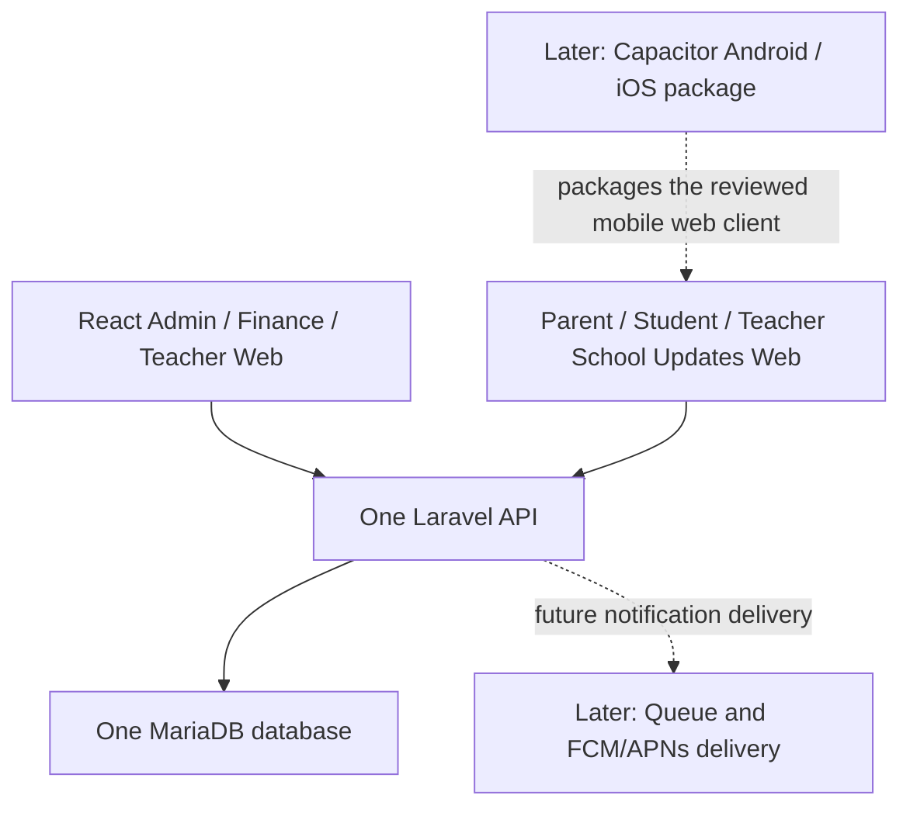

# Mobile Product Architecture and Roadmap

**Status:** The split App client, School Updates, daily Attendance, Assessment publication, Parent Finance reads, Schedule, and formal Quiz are implemented; native packaging, push delivery, and Practice/AI Quiz remain planned

**Reviewed:** 2026-08-14

The Admin and App clients are now tenant-aware SaaS surfaces. Each tenant may have distinct Admin/App subdomains and frontend branding while sharing one Laravel backend and authoritative database. The hostname resolves the tenant before membership, role, school and resource scope. This changes deployment/configuration, not the approved native sequencing below. See [SaaS Multi-Tenancy](saas-multitenancy.md).

## Status Language

This document uses three distinct states:

- **Implemented:** present in this repository and covered by current code/tests.
- **Approved, not implemented:** a product or architecture decision that constrains future work.
- **Needs confirmation:** a decision that still requires product, operational, or security approval.

The `frontend/` application is the responsive Admin/Finance interface. The separate root `app/` workspace is the mobile-first multi-role Community App and has its own build and tests. No native package, push integration, or token-authentication stack exists yet.

## Target Product Architecture



The architecture has one backend, one database, one identity/RBAC system, and one finance source of truth. The mobile client must not duplicate users, parents, students, receipt rendering, outstanding-balance calculations, or finance ledgers.

The mobile experience is developed and validated first as a mobile-first web application on localhost/staging. Native Android packaging follows only after web behavior, authorization, API contracts, and device requirements are stable. iOS/Xcode/TestFlight remains later work.

## Delivery Phases

| Phase | Status | Scope |
| --- | --- | --- |
| A — Backend Foundation | Implemented and merged | School context, foundation roles, explicit portal links, academic years, enrolments, subjects, teaching assignments, minimum management APIs, policies/access services, audit, constraints, and tests |
| B — Mobile Web Shell | Implemented | Independent `app/`, session login, role-aware Parent/Student/Teacher shell, separate build/domain, and School Updates-first presentation |
| C — School Updates and Parent Records | Implemented | Relationship-scoped official Updates, employee publishing to whole-school or selected classes, Likes/Post Reports, children, published academics, and read-only Finance; comments and new direct-Student targeting are retired active workflows |
| D — Attendance and Assessments | Implemented | General Attendance sessions with daily marking, scoped history and audit; academic terms, assessments, publication, and authorized Parent/Student result reads |
| E — Teacher and Quiz | Formal Quiz implemented; Practice/AI Quiz planned | Teacher classes, formal quiz authoring, class/direct-student targets, materialized recipients, attempts, server-side scoring, and result visibility |
| F — Push and Native Packaging | Approved, not implemented | Device registration, FCM, Capacitor Android/APK, followed later by iOS/TestFlight evaluation |

No later phase is implicitly authorized by completion of an earlier phase. Each phase requires its own reviewed implementation scope and release evidence.

## Identity and Authentication

Phase A uses the existing `users`, roles, permissions, and many-to-many RBAC. Teacher, parent, and student are roles in that system; a user may hold multiple roles. Teachers do not receive a separate authentication table, and parent/student domain records are not duplicated for mobile.

Current Admin Web authentication remains Laravel session/cookie/CSRF authentication. Native authentication requires a separate threat and topology review. Do not invent a custom JWT system. Laravel Sanctum may be evaluated when native implementation begins, but it is not installed or approved by this roadmap.

Portal-user association is explicit and same-school. Migration or activation workflows must never guess a real account from name, email, or phone. Historical guardian links remain unreviewed until an authorized workflow activates them.

## Authorization Model

New self-service APIs must use the Phase A request chain: authenticated active user, permission middleware, resolved `SchoolContext`, policy/access service, school-scoped query, and transactional domain service where mutation occurs.

- Parent access is derived from an explicitly linked, active guardian relationship and the relevant `can_view_*` flag.
- Student access is limited to the linked student's own academic/self-service data. Student finance is not a V1 requirement.
- Teacher access is derived from teaching assignments and cannot expand to arbitrary school students.
- Multi-role users receive the union of permissions, but every resource relationship must still pass its own school and subject/class/guardian scope checks.
- Client navigation is usability only. Laravel remains authoritative against IDOR and cross-school access.

## Parent Finance Rules

`fee_record_charges` and the existing payment-allocation services remain authoritative. Mobile endpoints must call the same finance-domain logic as Admin; they must not introduce a mobile balance table, `fee_installments` ledger, or client-side balance calculation.

An authorized guardian with finance access sees the student's account payment history, regardless of which guardian physically made a payment. Receipt access reuses the existing authoritative receipt resource/output; a separate mobile receipt format is not created.

Complex installment due dates, grace periods, and custom schedules are not approved. V1 reminders may refer to an outstanding billing month. If an amount snapshot is retained for notification display/audit context, it is not the current financial balance.

## Notifications and Payment Reminders

Manual payment reminder is the required V1 workflow:

```text
Admin or Finance action
  -> Laravel rechecks authoritative outstanding data
  -> resolves explicitly authorized guardian recipients
  -> creates durable in-app notifications
  -> writes transactional audit/history metadata
  -> later queues optional push delivery
```

The system must record the actor, student/account context, time, and resolved guardians. Automatic scheduled reminders are a later enhancement.

The notification row is the durable product record. Push is only a delivery channel; delivery failure must not delete the in-app notification. Future device tokens must be protected and revoked when invalid. A separate delivery-history table is not required without a demonstrated V1 need.

## Quiz Boundary

Formal Quiz V1 is implemented beyond Phase A and supports `multiple_choice` and `true_false` through shared option storage and server-side scoring. Practice/AI Quiz remains planned.

Each quiz assignment represents one release/configuration and supports both class targets and direct student targets. Eligibility is materialized in `quiz_assignment_recipients` so overlapping class/direct targeting cannot create duplicate notifications, attempts, or results. Class targeting supports multiple classes; direct targeting supports one or many authorized students.

Teacher targeting remains bounded by same-school academic year, subject, class, enrolment, and teaching assignment. Correct answers never come from or get trusted from the client. Published content is immutable; material corrections use a clone/revision. Quiz results are not an official transcript or gradebook.

## Testing Gates for Future Phases

Each mobile phase must add backend authorization and cross-school tests before UI work is accepted. Phase-specific evidence must include:

- same-school and cross-school parent/student/teacher access;
- multi-role behavior and resource-specific scope;
- browser session behavior for Mobile Web without weakening Admin Web CSRF/session controls;
- authoritative finance parity between Admin and Parent surfaces;
- guardian access activation/revocation and historical-link denial;
- mobile viewport accessibility, loading/error/empty states, and production build;
- real-device/browser checks appropriate to the phase;
- for native work, credential/token storage, logout/revocation, deep-link, offline/error, push-token privacy, signed build, and platform review evidence.

Firebase, Capacitor, app-store delivery, and native authentication must remain **Not verified** until their phase is implemented and exercised on the target platform.

## Current Non-Goals

Chat, homework upload, automatic term-total formulas, class ranking, full transcripts, payment processing, and AI quiz execution are outside the approved first implementation slices. AI quiz generation remains a future authoring adapter; teachers must review generated content and normal quiz storage/scoring remains authoritative.

## Open Decisions

- The independent `app/` React workspace is fixed; remaining decisions concern its native wrapper/store strategy and production domain configuration.
- Exact native authentication and credential-revocation design.
- Supported Android/iOS versions and device matrix.
- Push-provider project ownership, environments, credentials, privacy policy, and operational monitoring.
- Receipt download/share mechanism before native packaging.
- Notification retention, localization, quiet hours, and automatic-reminder policy.
- Production deployment topology for the Mobile Web client and cross-origin/session implications.

These questions do not reopen the fixed decisions of one backend/database/RBAC system, authoritative finance reuse, explicit portal linking, class plus direct-student quiz targets, or manual-first payment reminders.

The detailed approved role flows, School Updates rules, attendance model, assessment boundary, Quiz separation, Finance boundary, and delivery order are recorded in [MIS App Product Specification](mobile-app-product-spec.md). Visual decisions are authoritative in the root [Design System](../DESIGN.md).
